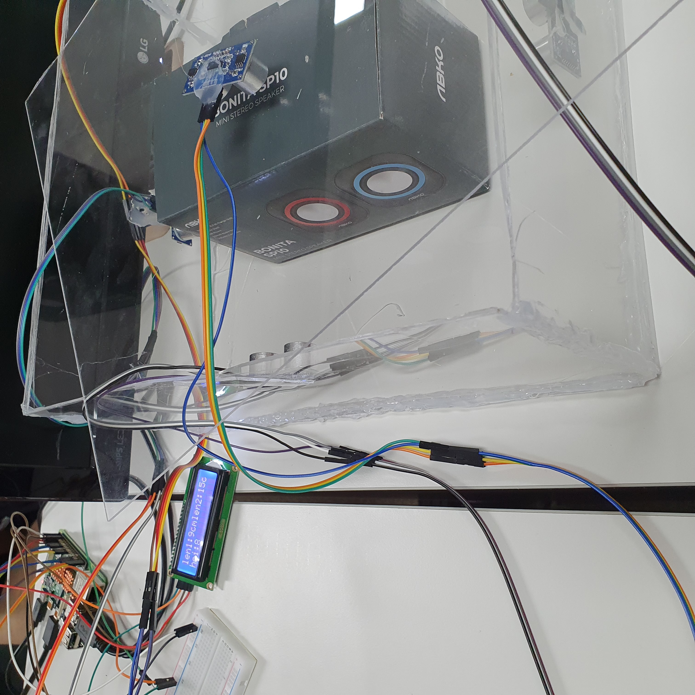

# Ultrasonic Time-of-Flight (ToF) Dimension Measurement System

A Raspberry Pi-based embedded system for real-time object dimension measurement using ultrasonic Time-of-Flight (ToF) sensors.

---

# Project Overview

This project was developed during the Creative Embedded System Program at Gyeongsang National University.

The objective was to build a real-time measurement system capable of estimating the width and height of an object using multiple ultrasonic sensors. The system continuously acquired sensor data, processed the measured distances, and displayed the calculated dimensions on an LCD module.

This project provided practical experience with embedded system integration, sensor interfacing, and real-time data acquisition using Raspberry Pi.

---

# Objectives

- Build a real-time measurement system
- Interface ultrasonic sensors with Raspberry Pi
- Acquire distance data continuously
- Calculate object dimensions
- Display measurement results on LCD

---

# System Architecture

```

Ultrasonic Sensors
↓
Distance Measurement
↓
Raspberry Pi
↓
Python Processing
↓
Dimension Calculation
↓
LCD Display

```

---

# Hardware Components

| Component | Description |
|-----------|-------------|
| Raspberry Pi | Main controller |
| HC-SR04 Ultrasonic Sensors | Distance measurement |
| LCD 16x2 Display | Measurement output |
| Breadboard | Circuit prototyping |
| Jumper Wires | Hardware connections |

---

# Measurement Principle

The system estimates object dimensions using the Time-of-Flight (ToF) principle.

Each ultrasonic sensor emits an ultrasonic pulse and measures the round-trip travel time of the reflected signal. The measured distance is then converted into object dimensions through calibration.

---

# Experimental Setup

The prototype was assembled using multiple ultrasonic sensors positioned around the measurement area.

Sensor measurements were collected continuously, processed by Raspberry Pi, and displayed on the LCD module in real time.

---

# Gallery

## Final Prototype


---

## Hardware Configuration


---

## Experimental Setup


---

## LCD Measurement Result



---

## Award

Bronze Prize (Encouragement Award)

Creative Embedded System Competition


---

# Lessons Learned

Through this project, I learned:

- Raspberry Pi hardware interfacing
- Ultrasonic sensor calibration
- Real-time embedded programming
- Sensor data acquisition
- Basic embedded system debugging
- Hardware integration and testing

---

# Future Improvements

- Improve measurement accuracy
- Apply digital filtering techniques
- Optimize calibration algorithms
- Develop a graphical user interface
- Support additional sensor configurations
