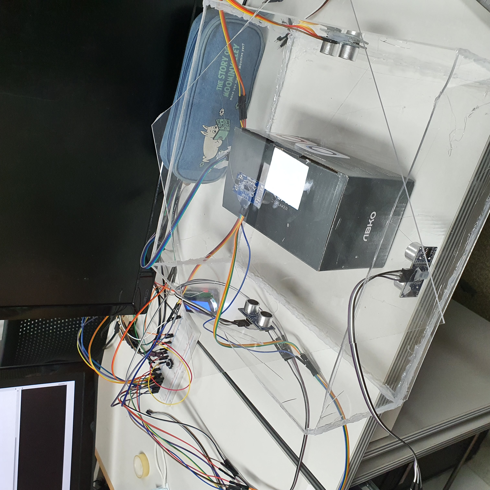
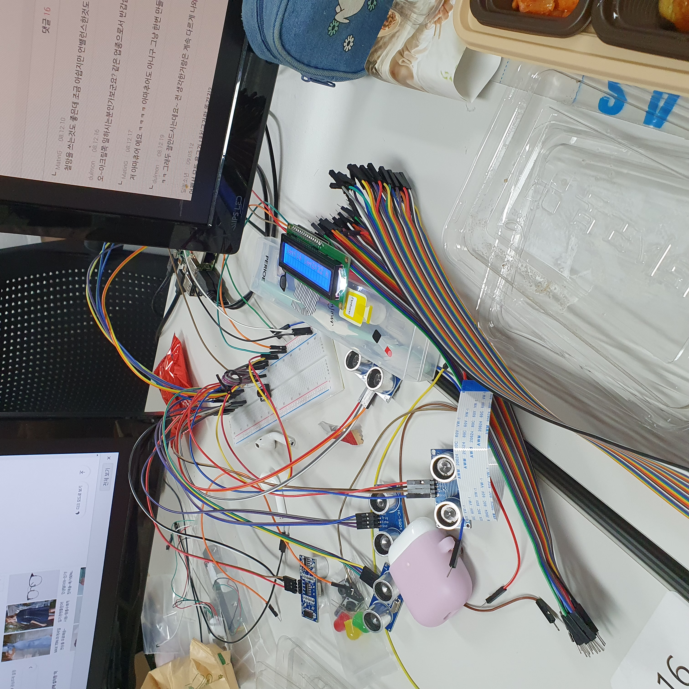
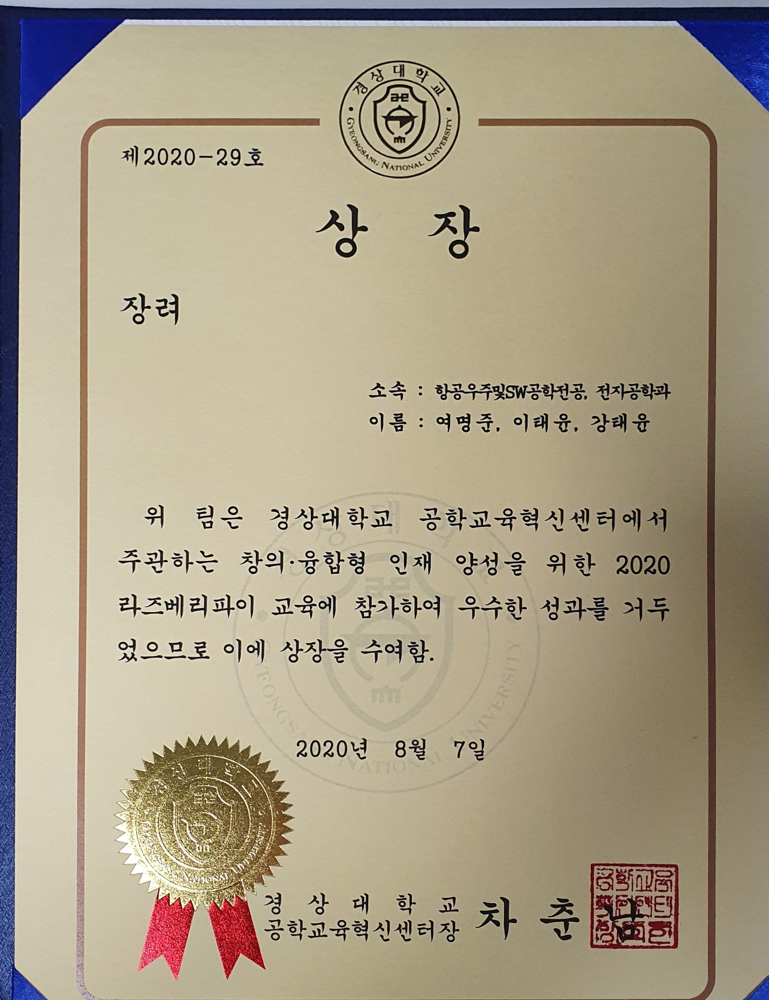

<div align="center">

# 📏 Ultrasonic ToF Dimension Measurement

### Raspberry Pi-based Embedded Measurement System



<br>


</div>

---

# 📖 Overview

This project was developed during the **2020 Raspberry Pi Design Education Program** at Gyeongsang National University.

Using Raspberry Pi and multiple HC-SR04 ultrasonic sensors, the system measures distances and displays the results on a 16×2 LCD module in real time.

The project was designed to gain practical experience in embedded systems, sensor interfacing, and Python-based hardware control.

---

# ✨ Highlights

- 🐍 Python Programming
- 🍓 Raspberry Pi
- 📡 HC-SR04 Ultrasonic Sensors
- 🖥 LCD Display
- 🔌 Embedded Hardware Integration
- 🏆 Bronze Prize (Creative Embedded System Competition)

---

# 🛠 Hardware

| Component | Description |
|-----------|-------------|
| Raspberry Pi | Main Controller |
| HC-SR04 | Ultrasonic Distance Sensor |
| LCD 16×2 | Measurement Display |
| Breadboard | Circuit Prototyping |
| Jumper Wires | Hardware Connection |

---

# 💻 Software

- Python
- Raspberry Pi GPIO

---

# 📷 Project Gallery

## 🔹 Prototype


---

## 🔹 Hardware Setup



---

## 🔹 LCD Display


---

## 🔹 Measurement Setup


---

## 🏆 Award



Bronze Prize – Creative Embedded System Competition (2020)

---

# 📚 What I Learned

✔ Raspberry Pi GPIO Programming

✔ Python-based Embedded Programming

✔ Ultrasonic Sensor Interfacing

✔ LCD Communication

✔ Hardware Integration

✔ Breadboard Prototyping

✔ Embedded System Debugging

---

# 📂 Repository

```text
.
├── README.md
├── ex.py
├── LICENSE
└── images
    ├── prototype.jpg
    ├── hardware_setup.jpg
    ├── lcd_display.jpg
    ├── measurement_setup.jpg
    └── award.jpg
```

---

<div align="center">

### ⭐ Educational Embedded System Project

Developed at Gyeongsang National University (2020)

</div>
